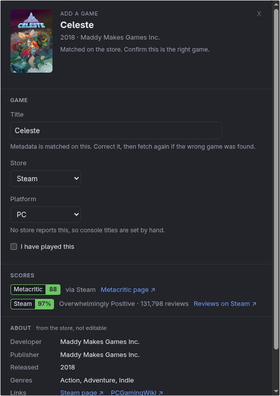
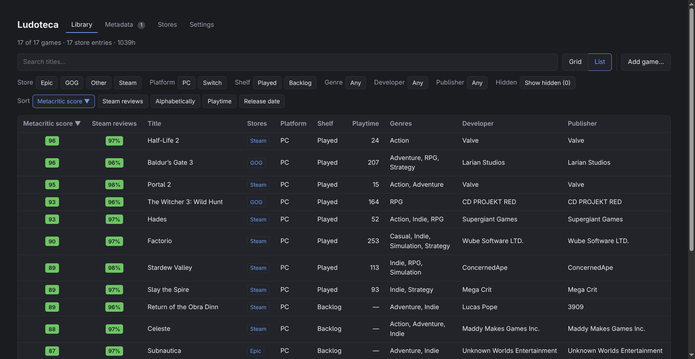
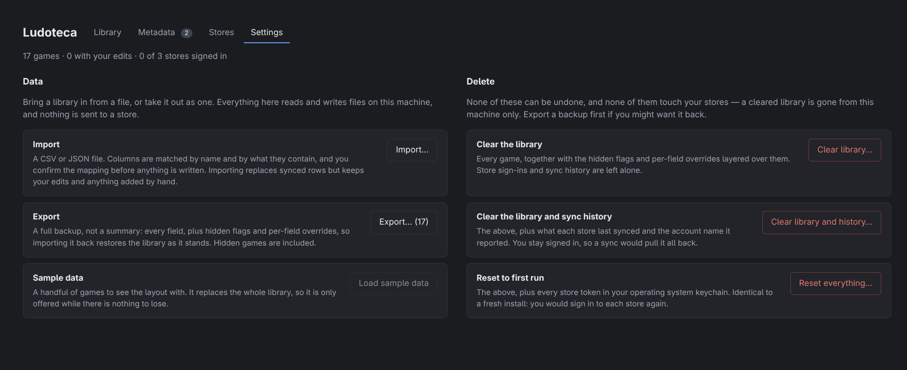

<h1 align="center">Ludoteca</h1>

<p align="center">
  <strong>Every game you own, in one place — including the ones you only share.</strong><br>
  A local desktop library that merges Steam, GOG and Epic into one sortable shelf, scores it
  from critics and players separately, and never sends your library anywhere.
</p>

<p align="center">
  
  
  
  
  
  
  
</p>

<p align="center">
  
</p>

<p align="center">
  <em>Every screenshot here is the built-in sample library plus two games added by hand, with
  metadata fetched live from Steam and PCGamingWiki. No store account was connected.</em>
</p>

> [!WARNING]
> **No store connector has completed a live sign-in yet.** Steam, GOG and Epic are written and
> reviewed, but unproven. The integrations are reverse-engineered, and an earlier version of the
> Steam one got a real account restricted for suspected unauthorised access. Use a throwaway
> account first. See [Caveats](#caveats).

**Contents** — [What it does](#what-it-does) · [Quick start](#quick-start) ·
[Your data](#your-data) · [Architecture](#architecture) · [Development](#development) ·
[Building a release](#building-a-release) · [Caveats](#caveats) · [License](#license)

## What it does

You own games in three places and can't answer *"what should I play?"* without opening three
launchers. Ludoteca reads them into one local database, then lets you sort by **Metacritic
score**, **Steam reviews**, title, playtime or release date, and filter by store, platform,
shelf, genre, developer or publisher.

- **Family-shared games are first-class.** On Steam, the library you can *play* can be much
  larger than the one you *own*. Shared games get their own store filter, because "can I play
  this tonight" and "do I own this" are different questions.
- **A game bought twice appears once.** The same title from two stores becomes one card with
  both store links, while the database keeps both rows. Merging is a display decision, so a
  wrong merge is a display quirk, never lost ownership.
- **Played and Backlog, not three states.** Epic reports no playtime at all, so "unknown" isn't
  a state of play. A shelf describes where a game sits, and can't be wrong.
- **Consoles are welcome, by hand.** No store reports what you played on a Switch, so console
  titles are added manually with a platform tag that survives every re-import.

### Two scores, kept apart

Critics and players measure different things, so each game carries two labelled chips: a
**Metacritic** score and the **Steam** review percentage — the share of players who recommend
it. They sort separately and never stand in for each other. Across one real library, Steam ran
a median 7 points above Metacritic; Goat Simulator is 62 on one and 90% on the other.

<p align="center">
  
  &nbsp;
  
</p>

**Clicking a cover opens the game's details** — scores with their sources, what the store says
about it, where you own it, and links to its store pages and PCGamingWiki. Title and platform
are edited in place there; everything else is fetched, never typed, because a hand-typed score
isn't one. The same page adds a game by hand: fetch first, check the match, then add. Change the
title after fetching and the preview is discarded, so nothing is ever added against a stale
lookup.

### Metadata, fetched and paced

Scores, cover art, genres, developer, publisher and release year come from Steam's public store
endpoints — no API key — for GOG and Epic games too, since a Metacritic score is the same
wherever the game was bought.

- **Batched where Steam allows it.** Covers and review summaries arrive a hundred games per
  request. Store details are one game per request, and that is the ceiling: a full refetch runs
  at about 50 games a minute, roughly ten minutes for a 550-game library, paced to stay under
  Steam's rate limit rather than retrying into it.
- **A match is only trusted when the title matches.** Steam's search always returns *something*,
  so an unmatched game goes to a **Find match…** picker instead of silently taking the top hit.
  A match you pick is pinned, and a synced Steam game uses its own id without searching at all.
- **Live progress.** A bar with counts, the game being looked up, and an estimate of the time
  left from the last minute of throughput. It stays in the header while you use the other tabs,
  can be stopped at any point, and keeps what it found.

<p align="center">
  
</p>

**PCGamingWiki fills the gaps, if you ask.** Steam has no Metacritic score for many games
Metacritic has rated, and no page for games owned on Epic or GOG. Metacritic itself can't be read
automatically — its terms forbid it. An optional pass looks those games up on
[PCGamingWiki](https://www.pcgamingwiki.com/) by Steam app id and fills in what its editors
recorded: the Metacritic score with the page it came from, and the Epic or GOG store page. It
only fills empty fields, remembers which games it has checked, and shows how long it would take
for your library before you start it, because the wiki allows one request a second. Wiki content
is credited under CC BY-NC-SA.

**Update Steam reviews** refreshes every review score in a few batched requests without
searching again, since player scores drift over time.

### The library

The **grid** is cover art, both score chips, a store tag and playtime. The **list** carries every
field, all sortable, with missing values sinking to the bottom in both directions rather than
sorting among the As.

<p align="center">
  
</p>

Categorical fields filter and ordinal fields sort, which leaves five sort terms — few enough to
show as chips instead of hiding in a dropdown. Filter chips only appear for values the library
actually has.

Hiding is how an imported game is removed, from its details page, since a delete would be undone
by the next import. Only games added by hand, which have no upstream, are truly deleted.

## Quick start

Needs **Node.js 26+** and **npm 12+**, which `npm install` enforces. Node 26 still ships npm 11,
so upgrade npm first:

```bash
npm install --global npm@12
git clone https://github.com/eduarddubau/ludoteca.git && cd ludoteca
npm install
npm run dev          # builds core, then runs it with Vite and Electron
```

No account is needed to try it. The library starts empty:

1. On **Settings**, **Load sample data** fills it with fifteen games — or **Import…** a CSV or
   JSON file of your own. [`examples/`](examples) has ready-made files and a table of every
   column; only the title is required.
2. On **Metadata**, press **Fetch missing** and watch it fill in.
3. Back on **Library**, click any cover.

| Tab | What it is |
| --- | --- |
| **Library** | The shelf: grid or list, search, filters, sorting, and adding games by hand |
| **Metadata** | Fetch and refetch, live progress, per-field coverage, the optional PCGamingWiki pass, and a picker for games it couldn't match |
| **Stores** | Connect Steam, GOG or Epic, with observed status rather than assumed |
| **Settings** | Import, export, sample data, and three separately scoped ways to delete |

## Your data

Everything is local, and there is no server to talk to.

<p align="center">
  
</p>

- **Export is a real backup.** CSV or JSON, the whole library rather than the filtered view, with
  ownership, hidden flags and your per-field edits, and playtime in minutes so nothing rounds on
  the way back. Importing it restores the library as it was.
- **Import keeps what's yours.** Your edits and hidden flags live in their own table, layered
  over imported rows. Importing a file that doesn't record them — a hand-built list, another
  tool's export — leaves them alone, and games you added by hand survive it. Restoring a
  Ludoteca backup sets them back to what the backup recorded.
- **Deleting is scoped and deliberate.** Clear the library, clear it with sync history, or reset
  to first run including store sign-ins. Each lists what it will delete and waits for you to type
  the count it shows.

<p align="center">
  
</p>

Sign-in happens on the store's own page, only the token is kept, and the Stores tab says so where
the decision is made. Status is **observed, not assumed**: a stale "Connected" over a dead token
is the classic failure of this kind of screen.

| What | Where |
| --- | --- |
| Library database | `ludoteca/ludoteca.db` under the OS config directory — `~/.config` on Linux, `%APPDATA%` on Windows |
| Store tokens | The OS keychain via Electron `safeStorage` — Keychain, libsecret or DPAPI |
| Window size | `ludoteca/window.electron.json` beside the database |
| Everything else | Chromium's own profile, under the app name |

Disconnecting a store clears the local token only. Deauthorising devices in your store account is
what actually ends a session, and the app says so.

## Architecture

<p align="center">
  
</p>

An npm-workspaces monorepo shaped to keep one UI running in more than one shell:

| Package | What it is |
| --- | --- |
| [`packages/core`](packages/core) | Plain TypeScript with no framework and no shell APIs: the store connectors, enrichment, merge and override rules, import and export, and the `Platform` contract. |
| [`packages/ui`](packages/ui) | The Vue 3 app — every tab and dialog. Talks to a `Platform`, never to Electron. |
| [`apps/electron`](apps/electron) | The first shell: an ES-module main process, a sandboxed preload bridge, SQLite, the OS keychain and the sign-in windows. |

### What it demonstrates

- **One capability contract, many shells.** `Platform` has five members — `authenticate`,
  `cookies`, `http`, `db`, `secrets` — and `core` and `ui` may use nothing else. A lint rule makes
  importing `electron`, `better-sqlite3` or a Node built-in an error, so the boundary is enforced
  rather than remembered. A Tauri shell is the planned second implementation.
- **Webview redirect interception is the load-bearing trick.** Store OAuth redirect URIs are fixed
  by the official launchers, so a loopback server can't catch them; sign-in has to happen in a
  window the app watches. All four ways a login reaches its redirect — a 302, a meta refresh,
  `location.assign` and a delayed `location.replace` — were proven caught against an offline
  harness during development.
- **Store pages never touch the app's process.** Sign-in renders in its own window with no
  preload, a scratch cookie partition, and sandbox and context isolation set explicitly. IPC
  handlers check the sending window, so a store page can't reach the bridge.
- **The bridge is narrow on purpose.** `http` is https-only, because `net.fetch` would happily read
  `file:///etc/passwd`. The database takes parameterised statements only, and tokens never touch a
  plain file.
- **Schema drift is reconciled, not hand-migrated.** Live tables are diffed against the schema
  applied to an in-memory database and missing columns are added; explicit migrations are kept
  for changes a diff can't infer, such as splitting the matched Steam app out of the store link.
- **One reader for every import format.** CSV and JSON share the same value parsing, so
  `PlayStation 5`, `Epic Games Store` or `Finished` import the same way from either.

<details>
<summary><b>Inside <code>packages/core</code></b></summary>

- **`connectors/`** — one class per store, all over the shared `Platform`.
  - `steam.ts` — the ordinary Steam web login in a webview, then the `webapi_token` read from the
    store's own async config with that session's cookies. This deliberately replaces an earlier
    approach that impersonated the Steam mobile app from a desktop and got an account restricted.
  - `gog.ts` — Galaxy's own OAuth client. GOG rotates the refresh token on every exchange, so the
    new one has to replace the stored one or the next sync fails.
  - `epic.ts` — the authorization code arrives in a JSON *body*, not a URL, so the webview only
    establishes a session and the code is read by calling the redirect endpoint with its cookies.
  - `http.ts` — shared store HTTP: a desktop User-Agent, an HTML body treated as an expired session
    rather than a parse error, and 403 reported as rate limiting rather than a reason to sign in
    again.
- **`enrich/`** — `steam.ts` matches over `storesearch` and `appdetails`, batches covers and
  reviews through `IStoreBrowseService/GetItems`, and paces every request; `pcgamingwiki.ts` is
  the optional pass; `shared.ts` holds retries and transient-error handling.
- **`library/`** — `merge.ts` (cross-store entries and the owned/shared facet), `userdata.ts`
  (edits, hiding, and what survives an import), `connections.ts` (store profiles and cooldowns).
- **`import/` and `export/`** — CSV and JSON both ways. A CSV header feeds one field only, and the
  *values* decide ambiguous ones: `platform` named the store in older files and the hardware in
  current ones.

</details>

## Development

| Command | What it does |
| --- | --- |
| `npm run dev` | Builds core, then runs its watcher beside the Vite dev server and Electron. Core and UI changes reach the window live; the Electron main process picks them up on restart |
| `npm run build` | Builds core and the UI |
| `npm run typecheck` | Type-checks every workspace, templates included |
| `npm run lint` | ESLint, including the shell boundary and a type-aware ban on deprecated APIs |

**CI** runs on every push to `master` and every pull request: a clean install, build, Electron
bundle, typecheck and lint. There is no automated test suite yet.

**Dependencies stay current.** Every dependency is on its latest stable release unless a verified
incompatibility holds it back — today only TypeScript 7, which typescript-eslint doesn't support
yet. Nothing deprecated is allowed: the linter fails on deprecated APIs, and deprecated packages
pulled in by other packages are replaced through npm `overrides`. Dependabot proposes updates
weekly. The two dependencies that declare install scripts don't need them, so `package.json`
denies both, and npm 12 runs no install script it hasn't been told to allow.

## Building a release

```bash
npm run package -w @ludoteca/electron   # unpacked, into apps/electron/release
npm run dist    -w @ludoteca/electron   # AppImage + rpm on Linux, NSIS installer on Windows
```

Pushing a `v*` tag builds Linux and Windows on GitHub Actions and publishes both with checksums;
running the workflow by hand builds without publishing. Release builds never reuse a cache that
other workflows can write.

Artifacts are **unsigned**. A code-signing certificate now has to live on a hardware token or a
cloud service, so there is no local key to sign with, and Windows shows a SmartScreen warning that
is entirely accurate. Packaged builds set the Electron fuses: `runAsNode`, Node CLI inspect,
`NODE_OPTIONS` and extra `file://` privileges off; cookie encryption, ASAR integrity and
`onlyLoadAppFromAsar` on.

## Caveats

- **No connector has completed a live sign-in.** Steam, GOG and Epic are written against reference
  implementations and reviewed; none has run against a real account. The code paths that matter
  most are the least proven.
- **The integrations are reverse-engineered.** None of these stores publishes a library API for
  third parties. Using them risks your account, and an earlier Steam approach here caused a real
  restriction. **Never run this on someone else's behalf** — reading your own library on your own
  machine is a different thing from operating a service.
- **Family sharing can't be tested on a throwaway.** A fresh Steam account proves the sign-in, but
  has no family group, so the shared library stays unverified until it meets a real account.
- **Metadata is Steam-shaped.** Games are matched through Steam, and PCGamingWiki is looked up by
  Steam app id, so a game Steam doesn't carry — any console exclusive — gets no score, art or
  genres.
- **A full refetch takes minutes.** Steam's per-game details endpoint sets the pace, at about 50
  games a minute.
- **No automated tests.** CI builds, typechecks and lints; behaviour has been verified by hand.
- **The AppImage won't start on a current Fedora.** It needs FUSE 2, which Fedora no longer
  installs by default; use the rpm, or `--appimage-extract-and-run`.
- **ASAR integrity is enabled but inert on Linux.** Enforcement exists only on macOS and Windows.
- **On Wayland, the window's position can't be restored,** because Wayland doesn't report it. Its
  size is, capped to the smallest connected screen.
- **There is no update channel.** A fix reaches an installed copy only if its owner downloads it
  again.
- **One shell, not two.** The `Platform` boundary is a claim no second implementation has tested
  yet; the Tauri shell is what would prove it.
- **Desktop only**, and no app icon: every artifact ships the default Electron logo.

## License

Copyright © 2026 Eduard Dubau. **All rights reserved.** The source is published to read; no
license is granted to use, copy, modify or distribute it. See [`LICENSE`](LICENSE).
