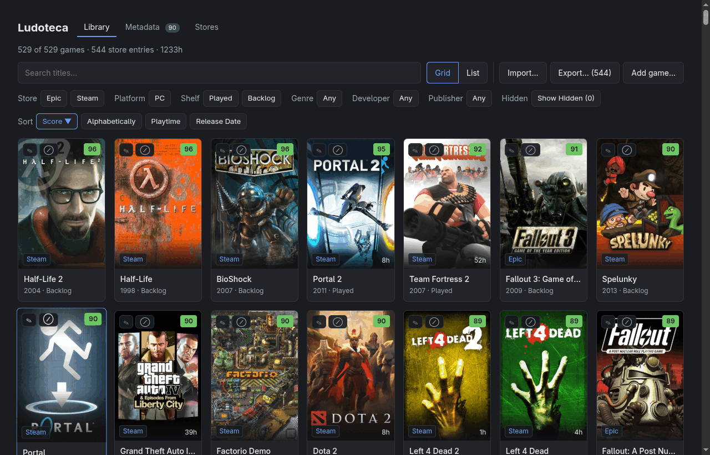
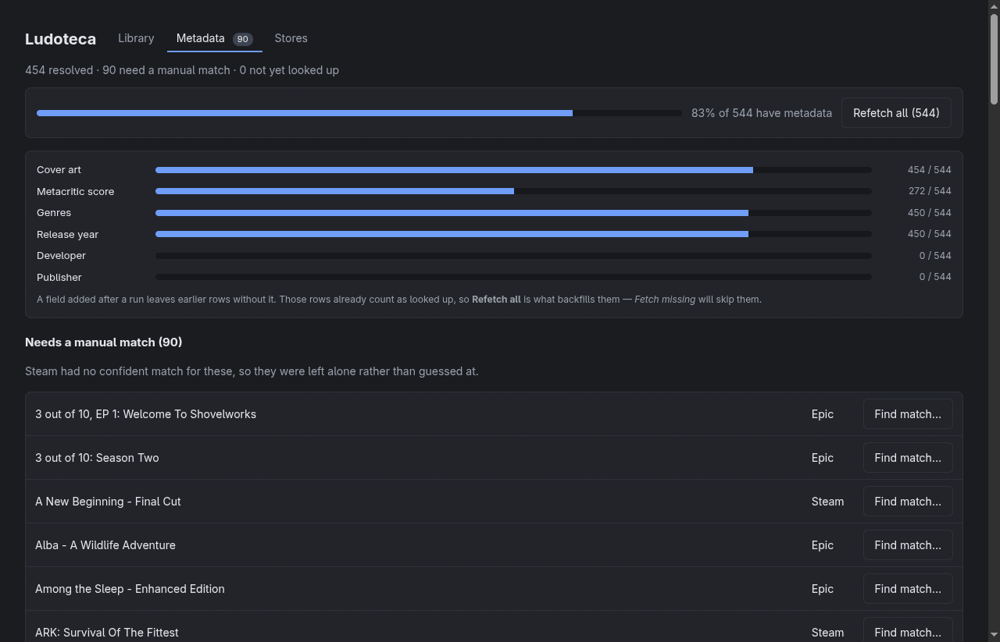
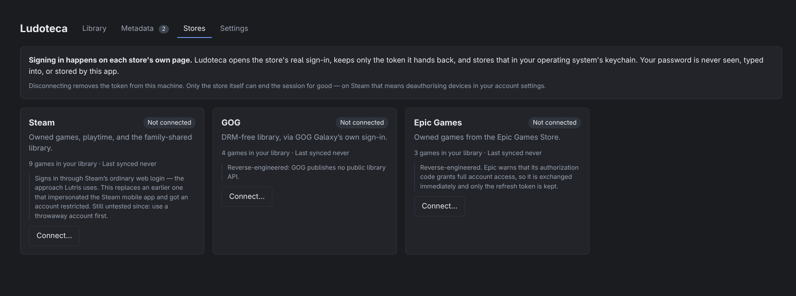

<h1 align="center">Ludoteca</h1>

<p align="center">
  <strong>Every game you own, in one place — including the ones you don't.</strong><br>
  A local desktop library that merges Steam, GOG and Epic into a single sortable shelf,
  keeps family-shared titles alongside owned ones, and never sends any of it anywhere.
</p>

<p align="center">
  
  
  
  
  
  
</p>

<p align="center">
  
</p>

<p align="center">
  <em>Every screenshot here is a real run over a 544-row library — imported from a file, since
  no store has been synced. That's also why the store filter shows no <strong>Steam
  (shared)</strong> chip and the platform filter shows only <strong>PC</strong>: those
  facets appear when the data carries them.</em>
</p>

> [!WARNING]
> **No store connector has ever completed a live sign-in.** Steam, GOG and Epic are all
> written, reviewed and unproven. The store integrations are reverse-engineered, and an
> earlier version of the Steam one got a real account restricted for suspected unauthorised
> access. Use a throwaway account first. See [Caveats](#caveats).

**Contents** — [What it does](#what-it-does) · [Quick start](#quick-start) ·
[Architecture](#architecture) · [The library](#the-library) ·
[Your data](#your-data) · [Building a release](#building-a-release) · [Caveats](#caveats)

## What it does

You own games in three places and can't answer *"what should I play?"* without opening three
launchers. Ludoteca reads all of them into one local database and lets you sort by Metacritic
score, Steam review score, playtime, release date or title, then filter by store, platform,
genre, developer, publisher or shelf.

**Family-shared games are first-class.** On Steam, the library you can *play* is much larger
than the library you *own* — a real account here has 213 owned and 489 shared. Most tools
either ignore the shared half or blur it into the rest. Here it's a separate filter, because
"can I play this tonight" and "do I own this" are different questions.

**A game bought twice appears once.** The same title from two stores merges into one card
carrying both store links, while the database keeps them as separate rows — merging is a
display decision, and a wrong merge is worse than a duplicate.

**Metadata is fetched, never invented.** Scores, cover art, genres, developer, publisher and
release year come from Steam's public endpoints — no API key — including for GOG and Epic
titles, since a Metacritic score is the same score wherever the game was bought. What you can
edit is the game's *identity*: correct a title and fetch again. There's no field for typing a
score by hand, because a hand-typed score isn't one.

**Critics and players are scored apart.** Steam's review score — the share of players who
recommend a game — sits beside the Metacritic chip as its own outlined chip, column and sort,
never in the Metacritic slot. The two measure different things: across one 279-game library
Steam ran a median 7 points higher, and Goat Simulator is 62 on Metacritic but 90% on Steam.
Review scores drift, so **Update scores** refreshes the whole library in a few batched requests
without searching again.

**Metacritic scores Steam doesn't show come from PCGamingWiki.** Steam carries no score for
many games Metacritic has rated — 186 of 465 matched games in one library. Metacritic itself
can't be read automatically: Fandom's terms forbid it and its robots.txt closes search. So for
those games Ludoteca looks up the [PCGamingWiki](https://www.pcgamingwiki.com/) page by Steam
app id and reads the Metacritic score its editors recorded, with the Metacritic page it came
from; on that library it found 86 more, and agreed with Steam on 70 of the 73 it could check.
The chip notes the source, the wiki's CC BY-NC-SA content is credited on the Metadata tab, and
requests are paced under its limit of one a second.

<p align="center">
  
</p>

Nothing is written until you confirm. Change the title after fetching and the preview is
discarded rather than kept — confirming an add against a stale lookup is the obvious way to
get this wrong.

**Consoles are welcome, manually.** No store API reports that you played something on a
Switch, so Xbox, PlayStation and Switch titles are added by hand and carry a platform tag —
which survives re-imports, so relabelling isn't work you do twice.

## Quick start

```bash
git clone https://github.com/eduarddubau/ludoteca.git && cd ludoteca
npm install
npm run dev          # Vite + Electron, hot-reloading
```

No account is needed to try it. The library starts empty; on the Settings tab, **Load sample
data** fills it with fifteen rows to show the layout, and **Import…** takes a CSV or JSON
file — a CSV needs only a title column, and the importer maps the rest by matching headers,
showing you its guesses before anything is written.

Then press **Fetch missing** on the Metadata tab and watch it fill in. **Refetch all** redoes
every row, and **Find match…** opens a picker for the titles it couldn't place on its own.

<p align="center">
  
</p>

That screenshot is honest about a real limitation: **developer and publisher read 0 / 544**
because those fields were added to enrichment after that run. Rows already count as looked up,
so *Fetch missing* skips them and only *Refetch all* backfills — which is exactly why the
coverage is shown per field rather than as one percentage.

| Tab | What it is |
| --- | --- |
| **Library** | The shelf: grid or list, filters, sorting, add/edit/hide |
| **Metadata** | Fetch progress, per-field coverage, and a picker for titles it couldn't match |
| **Stores** | Connect Steam, GOG or Epic — observed status, not assumed |
| **Settings** | Import, export, sample data, and three separately scoped ways to delete |

## Architecture

<p align="center">
  
</p>

An npm-workspaces monorepo whose whole shape exists to keep one UI running in more than one
shell:

| Package | What it is |
| --- | --- |
| [`packages/core`](packages/core) | Plain TypeScript, no framework and no shell APIs: the store connectors, merge and override rules, import/export, Steam enrichment, and the `Platform` contract. |
| [`packages/ui`](packages/ui) | The Vue 3 console — library grid and table, filters, the metadata run, the stores tab. Talks to a `Platform`, never to Electron. |
| [`apps/electron`](apps/electron) | The first shell: main process, preload bridge, SQLite, OS keychain, and the sign-in windows. |

### What it demonstrates

- **One capability contract, many shells.** `Platform` is five members — `authenticate`,
  `cookies`, `http`, `db`, `secrets` — and `core`/`ui` may use nothing else. An ESLint rule
  makes reaching for `electron`, `better-sqlite3` or a Node built-in a build error, so the
  boundary is enforced rather than remembered. A Tauri shell is the planned second
  implementation, and the reason the seam exists at all.
- **Webview redirect interception is the load-bearing trick.** Store OAuth redirect URIs are
  fixed by the official launcher clients, so a loopback catcher is useless — the sign-in has
  to happen in a window the app can watch. All four ways a login can reach its redirect
  (a 302, a meta refresh, `location.assign`, a delayed `location.replace`) are caught, proved
  against an offline harness rather than against real store logins.
- **Store pages never touch the app's process.** Sign-in renders in its own window with no
  preload, a scratch cookie partition, and sandbox plus context isolation spelled out rather
  than inherited. IPC handlers check the sending window, so a store page can't reach the
  bridge even though it's an Electron window too.
- **The bridge is narrow on purpose.** `http` is https-only, because `net.fetch` will happily
  serve `file:///etc/passwd` and hand it back. The database surface takes parameterised
  statements only. Secrets are restricted to connector keys. Tokens live in the OS keychain —
  never a plain file, which is what most comparable tools do.
- **Schema drift is reconciled, not migrated.** The live tables are diffed against the schema
  applied to a throwaway in-memory database, and missing columns are added. Hand-written
  additive migrations have to be kept in step by memory, and once weren't — the version said 3
  while two columns were missing and every insert failed.
- **User intent survives the data.** Every import truncates the game table, so hiding, manual
  additions and per-field corrections live in their own table and are layered back on read.
  Correcting a title leaves the score free to update on the next fetch.
- **An export you can actually restore from.** The CSV carries every field including ownership,
  hidden state and per-field overrides, exports the whole library rather than the filtered
  view, and stores playtime in minutes — rounding to hours turned 97 minutes into 120 on the
  way back.

<details>
<summary><b>Inside <code>packages/core</code></b></summary>

- **`connectors/`** — one class per store, all over the shared `Platform`.
  - `steam.ts` — the ordinary web login in a webview, then the `webapi_token` read from the
    store's own async config with that session's cookies. This deliberately replaces an
    earlier approach using `steam-session` with `EAuthTokenPlatformType.MobileApp`, which
    impersonates the Steam mobile app from a desktop and got an account restricted.
  - `gog.ts` — Galaxy's own OAuth client. GOG rotates the refresh token on every exchange, so
    the new one has to replace the stored one or the next sync fails.
  - `epic.ts` — the authorization code arrives in a JSON *body*, not a URL, so the webview only
    establishes a session and the code is read by calling the redirect endpoint with its
    cookies. `Platform.authenticate` returning cookies was speculative when the contract was
    written and turns out to be what makes Epic possible at all.
  - `http.ts` — shared store HTTP: a desktop User-Agent, an HTML body treated as an expired
    session rather than a parse error, and 403 reported as rate limiting rather than as a
    reason to sign in again.
- **`library/`** — `merge.ts` (cross-store entries and the owned/shared facet), `userdata.ts`
  (overrides, hiding, and what survives an import), `connections.ts` (store profiles and
  cooldowns).
- **`enrich/steam.ts`** — keyless matching over `storesearch` + `appdetails`. Acceptance scans
  the whole result list rather than the top hit, since sequels outrank originals, and retries
  on the leading phrase when a subtitle separator makes Steam return nothing at all.
- **`import/` and `export/`** — CSV and JSON both ways, with column mapping, and a rule that a
  header feeds one field only: `platform` names the store in older files and the hardware in
  current ones, so the *values* decide which it is.

</details>

## The library

Two views over the same data. The **grid** is cover art, score chip, store tags and playtime,
with per-game actions visible at rest — not revealed on hover, because a control nobody can
find is not a control, and hover has no equivalent on a touch screen. The **list** carries
every field there is, all sortable, with missing values sinking to the bottom in both
directions rather than sorting among the As.

<p align="center">
  
</p>

Filtering is faceted: store, platform, shelf, genre, developer, publisher. Categorical fields
filter and ordinal fields sort — ordering by a studio name tells you nothing you couldn't get
by selecting one — which leaves four sort terms, few enough to expose as chips instead of
hiding in a dropdown.

**Played and Backlog, not three states.** An earlier version had played/unplayed/unknown, but
all 334 "unknown" rows had no playtime at all, which meant *Epic reports nothing* rather than a
third state of play. A shelf describes where a game sits, so it can't be wrong.

Games can be added, edited, hidden and deleted by hand. Hiding is how an imported game is
removed, since a delete would be undone by the next import; only manually added rows, which
have no upstream, are truly deleted.

## Your data

Everything is local, and there is no server to talk to.

<p align="center">
  
</p>

The claim sits on the screen where the decision is made rather than in a readme: sign-in
happens on the store's own page, only the token is kept, and it lives in the keychain. Status
is **observed, not assumed** — the documented failure in this kind of screen is a stale
"Connected" over a dead token, leaving the user to guess that reconnecting is the fix.

| What | Where |
| --- | --- |
| Library database | `ludoteca/ludoteca.db` under the OS config dir — `~/.config` on Linux, `%APPDATA%` on Windows |
| Store tokens | OS keychain via Electron `safeStorage` — Keychain, libsecret, DPAPI |
| Everything else | Chromium's own profile, under the app name |

The database path is deliberately shell-independent so an Electron and a Tauri build can share
one library. Disconnecting a store clears the local token only — deauthorising devices in your
store account is what actually ends a session, and the app says so rather than implying
otherwise.

## Building a release

```bash
npm run package -w @ludoteca/electron   # unpacked, into apps/electron/release
npm run dist    -w @ludoteca/electron   # AppImage + rpm on Linux, NSIS installer on Windows
```

Tagging `v*` builds both platforms on GitHub Actions and publishes them with checksums.
Artifacts are **unsigned**: since 2023 a code-signing certificate has to live on a hardware
token or a cloud service, so there is no local key to sign with, and Windows will show a
SmartScreen warning that is entirely accurate.

Packaged builds set the Electron fuses — `runAsNode`, node CLI inspect, `NODE_OPTIONS` and the
extra `file://` privileges off; cookie encryption, ASAR integrity and `onlyLoadAppFromAsar` on.

## Caveats

- **No connector has completed a live sign-in.** Steam, GOG and Epic are written against
  reference implementations and reviewed, and none has been run against a real account. The
  code paths that matter most are the least proven ones.
- **The integrations are reverse-engineered.** None of these stores publishes a library API for
  third parties. Using them risks your account, and an earlier Steam approach here caused a
  real restriction for suspected unauthorised access. **Never run this on someone else's
  behalf** — reading your own library on your own machine is a different thing from operating
  a service.
- **Family sharing can't be tested on a throwaway.** A fresh Steam account proves the auth
  path, but it has no family group, so the shared library — the half that motivated the
  project — stays unverified until it points at a real account.
- **Metadata is Steam-shaped.** GOG and Epic titles are matched by searching Steam, so anything
  Steam doesn't carry gets no score, art or genres. RAWG would fill that gap and needs an API
  key.
- **The AppImage won't start on a current Fedora.** It needs FUSE 2, which Fedora no longer
  installs by default; use the rpm, or `--appimage-extract-and-run`.
- **ASAR integrity is enabled but inert on Linux.** Enforcement exists only on macOS 16+ and
  Windows 30+. The fuse is set; on Linux nothing checks it.
- **There is no update channel.** A fix reaches an installed copy only if you tell its owner to
  download again.
- **One shell, not two.** The `Platform` boundary is a claim no second implementation has
  tested yet. The Tauri shell is the thing that would prove it.
- **Desktop only.** Mobile is deferred, and the stack was chosen and un-chosen twice over that
  question.
- **No app icon.** Every artifact currently ships the default Electron logo.
